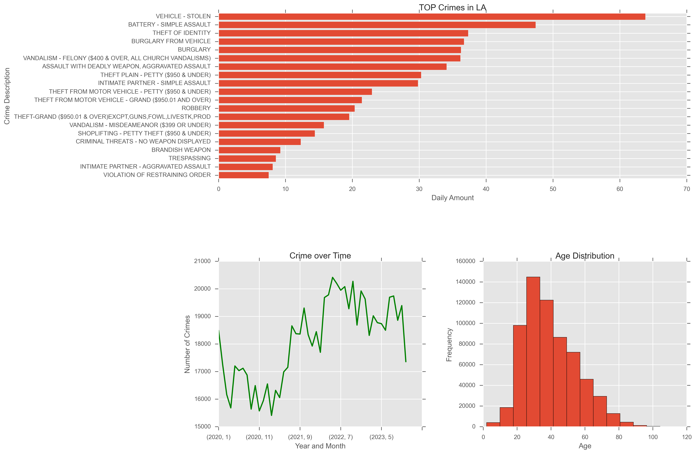

# LA Crime Analysis

This project analyzes crime data from Los Angeles from 2020 to 2023 using Python, Pandas, and Matplotlib.

## 📁 Dataset
- Source: [Los Angeles Open Data Portal](https://data.lacity.org/Public-Safety/Crime-Data-from-2020-to-Present/2nrs-mtv8/about_data)
- File: `Crime_Data_from_2020_to_Present.csv`

## 🔧 Tools Used
- Python
- Pandas
- Matplotlib

## 📊 Key Insights
- Crime trends over time (monthly and yearly)
- Most common crime types and their frequency
- Distribution of victim ages
- Crimes during nighttime and by hour
- Average report delay per crime type

## 📈 Visualizations
Example:  

## 📝 Project Structure
- `LA_Crime_Project.ipynb`: Jupyter notebook with full analysis
- `multiplot_ajustado_final.png`: Final multi-plot chart
- `README.md`: This documentation

## 🚀 How to Use
1. Clone the repository
2. Open the notebook in Jupyter
3. Make sure you have the dataset in the same folder
4. Run the cells to reproduce the analysis

---

> Made with 💻 by Daniel Hernandes Gomes
